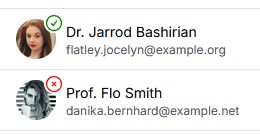
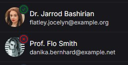

# Utility fields for User: Entry, Column

[](https://packagist.org/packages/deldius/filament-user-field)
[](https://github.com/deldius/filament-user-field/actions?query=workflow%3Arun-tests+branch%3Amain)
[](https://github.com/deldius/filament-user-field/actions?query=workflow%3A"Fix+PHP+code+styling"+branch%3Amain)
[](https://packagist.org/packages/deldius/filament-user-field)

[](https://plumbphp.dev/deldius/filament-user-field)
[](https://plumbphp.dev/deldius/filament-user-field)
[](https://plumbphp.dev/deldius/filament-user-field)
[](https://plumbphp.dev/deldius/filament-user-field)
[](https://plumbphp.dev/deldius/filament-user-field)

## Screenshots




## Installation

You can install the package via composer:

```bash
composer require deldius/filament-user-field
```

You can publish the config file with:

```bash
php artisan vendor:publish --tag="filament-user-field-config"
```

Optionally, you can publish the views using

```bash
php artisan vendor:publish --tag="filament-user-field-views"
```

This is the contents of the published config file:

```php
return [
    'user_model' => [
        'class' => \App\Models\User::class, // Default user model
        'fields' => [
            'id' => 'id', // Default user model ID field
            'avatar_url' => 'avatar_url', // Default user model avatar field
            'heading' => 'name', // Default user model name field
            'description' => 'email', // Default user model email field
        ],
    ],
    'active_state' => [
        'show' => false, // Show active state by default
        'field' => 'is_active', // Default field for active state
    ],
    'stacked' => [
        'limit' => 5,
        'modal' => false,
    ],
];
```

## FilamentPHP Components

### UserColumn (for Filament Tables)

Display user information in a Filament table column:

```php
use Deldius\UserField\UserColumn;
use Filament\Support\Enums\Size;

UserColumn::make('user_id')
    ->showActiveState() // Show active/inactive indicator
    ->size(Size::Small) // Set avatar size
    ->label('User') // Column label
```

Add `UserColumn` to your Filament table columns:

```php
public static function configure(Table $table): Table
{
    return [
        UserColumn::make('user_id'),
        // ...other columns
    ];
}
```
All available options:

```php
use Deldius\UserField\UserColumn;
use Filament\Support\Enums\Size;

UserColumn::make('user_id')
    ->showActiveState(true) // Show active/inactive indicator
    ->isActiveState(fn($user) => $user->is_active) // Custom active state logic
    ->showAvatar(true) // Show avatar
    ->avatarUrl(fn($user) => $user->avatar_url) // Custom avatar URL
    ->size(Size::Small) // Set avatar size
    ->heading(fn($user) => $user->name) // Custom heading
    ->description(fn($user) => $user->email) // Custom description
    ->emptyState(view('empty')) // Custom empty state view
    ->emptyStateHeading('No user') // Custom empty state heading
    ->emptyStateDescription('No user found') // Custom empty state description
    ->label('User') // Column label
```

Add `UserColumn` to your Filament table columns:

```php
public static function configure(Table $table): Table
{
    return [
        UserColumn::make('user_id'),
        // ...other columns
    ];
}
```

### UserEntry (for Filament Infolists)

Display user information in a Filament infolist entry:

```php
use Deldius\UserField\UserEntry;
use Filament\Support\Enums\Size;

UserEntry::make('user_id')
    ->showActiveState() // Show active/inactive indicator
    ->size(Size::Small) // Set avatar size
    ->label('User') // Entry label
```

Add `UserEntry` to your Filament infolist schema:

```php
public static function configure(Schema $schema): Schema
{
    return [
        UserEntry::make('user_id'),
        // ...other items
    ];
}
```
Display user information in a Filament infolist entry. All available options:

```php
use Deldius\UserField\UserEntry;
use Filament\Support\Enums\Size;

UserEntry::make('user_id')
    ->showActiveState(true) // Show active/inactive indicator
    ->isActiveState(fn($user) => $user->is_active) // Custom active state logic
    ->showAvatar(true) // Show avatar
    ->avatarUrl(fn($user) => $user->avatar_url) // Custom avatar URL
    ->size(Size::Small) // Set avatar size
    ->heading(fn($user) => $user->name) // Custom heading
    ->description(fn($user) => $user->email) // Custom description
    ->emptyState(view('empty')) // Custom empty state view
    ->emptyStateHeading('No user') // Custom empty state heading
    ->emptyStateDescription('No user found') // Custom empty state description
    ->label('User') // Entry label
```

Add `UserEntry` to your Filament infolist schema:

```php
public static function configure(Schema $schema): Schema
{
    return [
        UserEntry::make('user_id'),
        // ...other items
    ];
}
```

### UserSelect (for Filament Form)
_Planned feature: UserSelect support for Filament Form is in development and will be added in a future release._

## Advance Usage

### State and relationship resolution

When Filament provides an Eloquent model as the field state, the field uses that
concrete model directly. This supports regular and polymorphic relationships,
including morph targets whose class differs from the configured User model.

```php
UserColumn::make('actor') // `actor` may be a polymorphic relationship
```

When the state is only a scalar ID, the relationship type cannot be inferred.
The field resolves that ID using `user-field.user_model.class` and
`user-field.user_model.fields.id` from the package configuration.

Successful scalar lookups are cached for five seconds per model and ID. This
avoids repeating the same database lookup while rendering fields and mitigates
N+1 queries when the same user appears multiple times. Each unique uncached ID,
including a missing ID, may still require its own query, so eager-load
relationships whenever possible.

### Multiple users

Arrays and Laravel or Eloquent collections automatically trigger avatar-stack
rendering. Items may be Eloquent models or scalar IDs; scalar IDs resolve
through the configured User model. Unresolved items are skipped, while resolved
items retain their source order and duplicates.


```php
UserEntry::make('assignees')
    ->stackedLimit(5)
    ->stackedModal();

UserColumn::make('reviewers')
    ->stackedLimit(8);
```

`stackedLimit()` controls the number of visible avatars and defaults to the
global value of `3. `stackedModal()` is opt-in, is enabled globally by
default, and opens a read-only modal that lists every resolved user as a full
`UserEntry` card. When the modal is disabled, hovering a visible avatar shows
that user's heading and description. Hovering the `+N` badge shows the
headings of the hidden users represented by the badge.

Prefer eager-loaded model relationships to avoid per-ID queries. When scalar
IDs are used, successful lookups retain the five-second cache behavior, but
each unique uncached ID may still require a query.

## Testing

```bash
composer test
```

## Changelog

Please see [CHANGELOG](CHANGELOG.md) for more information on what has changed recently.

## Contributing

Please see [CONTRIBUTING](.github/CONTRIBUTING.md) for details.

## Security Vulnerabilities

Please review [our security policy](../../security/policy) on how to report security vulnerabilities.

## Credits

- [Trung](https://github.com/Deldius)

## License

The MIT License (MIT). Please see [License File](LICENSE.md) for more information.
