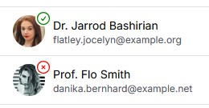

# Utility fields for User: Entry, Column

[](https://packagist.org/packages/deldius/filament-user-field)
[](https://github.com/deldius/filament-user-field/actions?query=workflow%3Arun-tests+branch%3Amain)
[](https://github.com/deldius/filament-user-field/actions?query=workflow%3A"Fix+PHP+code+styling"+branch%3Amain)
[](https://packagist.org/packages/deldius/filament-user-field)


This is a plugin for Filament v4

## Screenshots




## Installation

You can install the package via composer:

```bash
composer require deldius/filament-user-field
```

You can publish the config file with:

```bash
php artisan vendor:publish --tag="filament-user-field-config"
```

Optionally, you can publish the views using

```bash
php artisan vendor:publish --tag="filament-user-field-views"
```

This is the contents of the published config file:

```php
return [
    'user_model' => [
        'class' => \App\Models\User::class, // Default user model
        'fields' => [
            'id' => 'id', // Default user model ID field
            'avatar_url' => 'avatar_url', // Default user model avatar field
            'heading' => 'name', // Default user model name field
            'description' => 'email', // Default user model email field
        ],
    ],
    'active_state' => [
        'show' => false, // Show active state by default
        'field' => 'is_active', // Default field for active state
    ],
];
```

## Usage

### UserColumn (for Filament Tables)

Display user information in a Filament table column:

```php
use Deldius\UserField\UserColumn;
use Filament\Support\Enums\Size;

UserColumn::make('user_id')
    ->showActiveState() // Show active/inactive indicator
    ->size(Size::Small) // Set avatar size
    ->label('User') // Column label
```

Add `UserColumn` to your Filament table columns:

```php
public static function configure(Table $table): Table
{
    return [
        UserColumn::make('user_id'),
        // ...other columns
    ];
}
```
All available options:

```php
use Deldius\UserField\UserColumn;
use Filament\Support\Enums\Size;

UserColumn::make('user_id')
    ->showActiveState(true) // Show active/inactive indicator
    ->isActiveState(fn($user) => $user->is_active) // Custom active state logic
    ->showAvatar(true) // Show avatar
    ->avatarUrl(fn($user) => $user->avatar_url) // Custom avatar URL
    ->size(Size::Small) // Set avatar size
    ->heading(fn($user) => $user->name) // Custom heading
    ->description(fn($user) => $user->email) // Custom description
    ->emptyState(view('empty')) // Custom empty state view
    ->emptyStateHeading('No user') // Custom empty state heading
    ->emptyStateDescription('No user found') // Custom empty state description
    ->label('User') // Column label
```

Add `UserColumn` to your Filament table columns:

```php
public static function configure(Table $table): Table
{
    return [
        UserColumn::make('user_id'),
        // ...other columns
    ];
}
```

### UserEntry (for Filament Infolists)

Display user information in a Filament infolist entry:

```php
use Deldius\UserField\UserEntry;
use Filament\Support\Enums\Size;

UserEntry::make('user_id')
    ->showActiveState() // Show active/inactive indicator
    ->size(Size::Small) // Set avatar size
    ->label('User') // Entry label
```

Add `UserEntry` to your Filament infolist schema:

```php
public static function configure(Schema $schema): Schema
{
    return [
        UserEntry::make('user_id'),
        // ...other items
    ];
}
```
Display user information in a Filament infolist entry. All available options:

```php
use Deldius\UserField\UserEntry;
use Filament\Support\Enums\Size;

UserEntry::make('user_id')
    ->showActiveState(true) // Show active/inactive indicator
    ->isActiveState(fn($user) => $user->is_active) // Custom active state logic
    ->showAvatar(true) // Show avatar
    ->avatarUrl(fn($user) => $user->avatar_url) // Custom avatar URL
    ->size(Size::Small) // Set avatar size
    ->heading(fn($user) => $user->name) // Custom heading
    ->description(fn($user) => $user->email) // Custom description
    ->emptyState(view('empty')) // Custom empty state view
    ->emptyStateHeading('No user') // Custom empty state heading
    ->emptyStateDescription('No user found') // Custom empty state description
    ->label('User') // Entry label
```

Add `UserEntry` to your Filament infolist schema:

```php
public static function configure(Schema $schema): Schema
{
    return [
        UserEntry::make('user_id'),
        // ...other items
    ];
}
```

### UserSelect (for Filament Form)
_Planned feature: UserSelect support for Filament Form is in development and will be added in a future release._

## Testing

```bash
composer test
```

## Changelog

Please see [CHANGELOG](CHANGELOG.md) for more information on what has changed recently.

## Contributing

Please see [CONTRIBUTING](.github/CONTRIBUTING.md) for details.

## Security Vulnerabilities

Please review [our security policy](../../security/policy) on how to report security vulnerabilities.

## Credits

- [Trung](https://github.com/Deldius)

## License

The MIT License (MIT). Please see [License File](LICENSE.md) for more information.
